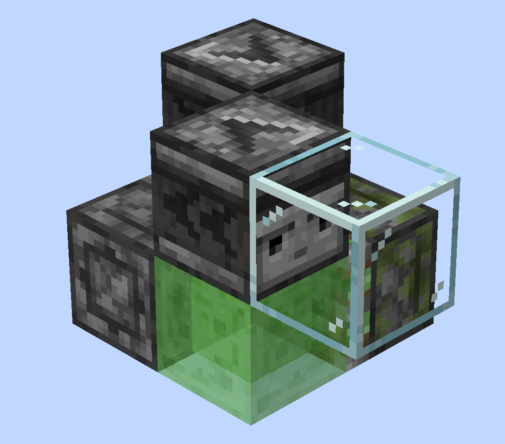

# 第一期 航械入门，从手搓第一台飞行器开始
你好！欢迎回到《从0开始的JE航械入门》，我是xxx
本期视频，我们将会带你制作你的第一台绿萌飞行器，并且带你走一遍最基础的飞行器时序、了解所使用原件的特性等，所以哪怕在此之前你没有过任何红石基础也没关系，当然，如果你对自己的红石基础能力有信心，可以直接跳过这一期。
在观看本期视频的同时，最好也打开游戏、上手试一试，相信你会有所收获的。
那我们开始吧
## 【小标题】前期准备
在开始正式的机器搭建之前，我们需要做一些准备，比如：安装正确的游戏客户端、给游戏安装一些很实用的模组等等。
首先，请确认：你的客户端安装了Fabric模组加载器——也就是常说的Fabric端。为什么不能用其他的例如Forge和NeoForge这些呢？因为其他的模组加载器对游戏的修改比较大，可能存在和原版不同的特性，所以我们不能保证所有机器设计都能完美运行。
除此之外，本系列教程所使用的游戏版本为1.21.10，如果可以的话，最好和我们保持同一版本。
然后，这里也向你推荐一些能让你搓机体验大幅提升的模组：
1. Carpet 地毯模组
   这个模组提供了很很多调试命令，比如创造模式穿墙等。常用的一些我们会在视频中介绍，其他一些可以看看简介里贴的链接。
   在这里也推荐一下Carpet GUI，这个模组为 Carpet提供了一个GUI界面，提供了搜索命令，收藏命令等实用功能。安装了这个模组之后就不用在聊天栏花半天时间找想要的命令了。
2. World Edit 创世神模组
   虽然是老牌建筑模组，但是也对搓机器有帮助。
3. Axiom 公理模组
   创世神模组的上位替代，提供了超多实用功能。推荐同时安装这两个模组。
4. 投影模组
   用来保存、分享机器的模组，本系列教程所涉及的机器也都将以投影形式分享。
5. Pistonder 活塞推出顺序显示
   显示活塞推、拉时，移动的活塞（b36）方块到位顺序显示。用到的时候你就知道多好用了。

因为做航械的时候会经常需要使用一些指令，因此最好再安装一款按键宏模组，例如Command keys或Command Macros。
前几期视频所涉及使用的模组就这些，以后用到的其他模组到时候再介绍，后面我们也会专门制作一期模组推荐视频。
最后，推荐你下载一款“红石显示”材质包，以便更加轻易的判断出活塞的种类、侦测器的朝向等问题。如果你不知道该哪款材质，我们推荐使用XeKr老师的红显材质，你可以在简介找到下载链接。
安装、配置完这些之后，我们就可以开始游戏了。

因为绿萌中的机器一般都运行在天上，所以我们可以选择直接在虚空环境中开始设计：
进入游戏后，点击单人游戏 > 创建新的世界，将游戏模式调为创造模式，再进入 “世界” 选项卡，世界类型调为 “超平坦”，再进入 自定义 > 预设，选择最下方的 “虚空” 选项，然后点击 “使用预设”，“完成” 并 “创建新的世界”。
等待世界加载完，你就进入了一个几乎全是虚空的存档了。

## 【小标题】年轻人的第一只活塞虫
进入游戏后，飞到空中，在聊天栏输入/up 1（安装了创世神的情况下）你的脚下就会出现一个玻璃方块。接下来，我们就可以通过这个玻璃方块作为起点开始建造了。
从背包中取出粘液块、普通活塞、粘性活塞和侦测器，并摆出这个造型。

接下来，打掉玻璃！这只活塞虫就开始移动了
恭喜你！完成了第一台飞行器的制作！你已经正式成为一名绿萌玩家乐😀

接下来，让我们仔细观察一下这台活塞虫：
这是一台以10gt为运行周期的活塞虫，这意味着它每10gt——也就是正常情况下、现实中的0.5秒——走一个方块的距离。
再观察它每次移动时的动作：
侦测器1先亮起，普通活塞推出，到位之后侦测器2亮起，粘性活塞伸出，然后侦测器2熄灭，粘性活塞拉回另外半边，以此循环......
这个时候就有聪明的观众要问了：这个侦测器对着空气是怎么激活活塞的，还有为什么这个机器是10gt循环?不应该是2+3+2+2+3=12gt吗？
侦测器激活活塞，是利用了Java版中，活塞的半连接性，即常说的QC。简单来说就是：**为活塞上方方块的位置供能，等同于对活塞供能**。这里侦测器对着活塞上面发出信号，就QC激活了活塞。关于半连接性以及活塞的一些其他特性，你可以观看[《从活塞到游戏机制》](https://www.bilibili.com/video/BV1P14y147ai)系列视频，或者查阅[GTMC的这篇文章](https://www.techmc.wiki/zh/articles/redstone-components/pistons)
至于为什么是10gt为周期——我们来做一个
## 【小标题】时序分析
你就明白了

首先，你需要知道gt的概念。gt，全称Game Tick——也就是 **游戏刻** ——是游戏中最小的完整时间单位。正常情况下，每秒会经过20个gt，如果你还不知道这个的话，最好先去去阅读一下[这篇文章](https://www.techmc.wiki/zh/articles/micro-timing/tick-timing)，我们在这里就不过多展开了。
让我们回到这个活塞虫：
第0gt：右半部分到位，侦测器1添加2gt“延迟”
第2gt：侦测器1亮起，激活活塞，活塞开始伸出
第4gt：左半边被到位，侦测器2添加2gt“延迟”
第6gt：侦测器2亮起，激活粘性活塞
第8gt：侦测器2熄灭，粘性活塞开始收回
第10gt：右半部分到位，侦测器1添加2gt“延迟”（回到第0gt）
......
对的对的。
但是如果你之前接触过红石，可能听说过“活塞有3gt延迟”的说法，这里为什么都是两gt活塞运动？
呃...对吗？
这里就要介绍活塞的另一个特性了。但是讲之前，你需要先了解一下
## 【小标题】（小字：初识）“微时序”
眼尖的观众可能已经发现，我前面介绍“游戏刻”时曾说过：gt是“游戏中最小的 **『完整』** 时间单位”，而微时序，就是小于游戏刻——或者说，在每个游戏刻中发生的——事件的顺序。
在1.19.3及以后的游戏版本中，游戏会在每个游戏刻处理[这些事件](https://fallen-breath.github.io/MinecraftGamePhase/phases/1.19.3-zh_cn.html)。
哎哎！先别急着退出视频，我们这期涉及到的微时序阶段没那么多，其实你只需要注意这些就行了：
1. 世界时间更新（WTU）
   每个游戏刻开始，第0gt就是在这个阶段变成第1gt的。
2. 计划刻阶段（TT）
   侦测器、中继器等原件运行的阶段，所以这些原件也被称为“计划刻原件”。拿侦测器举例，每当侦测器侦测到面前发生变化，就会添加一个两gt后（当前gt数+2）的“计划”。等到了执行“计划”的游戏刻，它就会在这个阶段检查自己的状态：已经亮起的话就熄灭、处于熄灭状态则亮起。
3. 方块事件阶段（BE）
   活塞运行的阶段。需要注意的是：如果活塞接收到的信号是在某gt的方块事件阶段当中、之前发生的，就会放在这个阶段处理，而这个阶段之后对活塞发出的信号则会放到下个gt处理。而且
4. 方块实体阶段（TE）
   关于这个阶段，你只需要知道：活塞推方块是有进度的，在方块事件阶段开始推出时进度为0，会在后面每个方块实体阶段检查一遍进度，如果小于1的话就给进度+0.5，如果等于1的话就把推的方块到位。

接着我们再看回分析，但是这次更加“细节”：
* 第0gt：
   * 方块实体阶段：右半部分到位，侦测器1添加2gt后的“计划”
* 第1gt：
   * 世界时间更新（WTU）：进入第1gt
* 第2gt：
   * 世界时间更新（WTU）：进入第2gt
   * 计划刻阶段（TT）：侦测器1执行“计划”，亮起并为活塞供能，接着添加2gt后的“计划”，这个是为了熄灭自己的
   * 方块事件阶段（BE）：普通活塞开始推出
   * 方块实体阶段（TE）：进度没满，于是+0.5
* 第3gt：
   * 世界时间更新（WTU）：进入第3gt
   * 方块实体阶段（TE）：进度没满，于是再+0.5，来到1
* 第4gt：
   * 世界时间更新（WTU）：进入第4gt
   * 计划刻阶段（TT）：侦测器1执行再次“计划”，熄灭自己（然而并没有什么影响）
   * 方块实体阶段（TE）：检查发现进度满了，于是到位左半边、侦测器2添加2gt后的“计划”
* 第5gt：
   * 世界时间更新（WTU）：进入第5gt
* 第6gt：
   * 世界时间更新（WTU）：进入第6gt
   * 计划刻阶段（TT）：侦测器2执行“计划”，亮起并为粘性活塞供能，接着添加2gt后的“计划”
   * 方块事件阶段（BE）：粘性活塞开始伸出
   * 方块实体阶段（TE）：未满，+0.5
* 第7gt：
   * 世界时间更新（WTU）：进入第7gt
   * 方块实体阶段（TE）：未满，+0.5，来到1
* 第8gt：
   * 世界时间更新（WTU）：进入第8gt
   * 计划刻阶段（TT）：侦测器2执行“计划”，熄灭并停止供能
   * 方块事件阶段（BE）：粘性活塞失去充能，于是停止伸出（直接完成进度），转而开始收回
   * 方块实体阶段（TE）：收回进度未满，+0.5
* 第9gt：
   * 世界时间更新（WTU）：进入第9gt
   * 方块实体阶段（TE）：收回进度未满，+0.5，来到1
* 第10gt：
   * 世界时间更新（WTU）：进入第10gt
   * 方块实体阶段：发现进度完成，到位右半部分，侦测器1添加2gt后的“计划”
......

这就是飞行器移动周期内发生的事情。
可是...分析这一切，有什么意义呢？（这里配上那种升格风景空镜头，音乐配Dramamine，做成[这个样子](https://www.bilibili.com/video/BV1yPqQYQErL)）
我不到啊——不过我知道：不了解怎么分析的话，做机器容易遇到“神秘问题”。
所以，微时序的学习也是很必要的，本期视频只是一例很粗浅分析，我们会在后面的视频里向你讲解更加深入的内容。
那么，本期视频的内容到这里也差不多要结束了，感谢各位的观看！
我们，下期再见！
【片尾】
